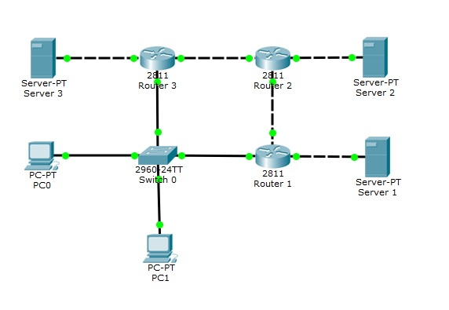

# Практика. RIP

Гридин Андрей (КН-202). Номер в журнале 7  (**n = 7**)

Создаем сеть, как показано в практике (Небольшое изменение в том, что PC0 и PC1 соеденины со Switch 0 прямым проводом). В каждый **Router (1-3)** добавляем физический модуль **NM-1FE-TX**.  



## Настройка Роутеров

#### Router 1

```Router>en
Router>en
Router#conf t
Router(config)#int fa0/0
Router(config-if)#ip addres 192.168.10.1 255.255.255.252
Router(cofig-if)#no shutdawn
Router(config-if)#exit

Router(config)#int fa0/1
Router(config-if)#ip addres 10.7.1.1  255.255.255.0
Router(cofig-if)#no shutdawn
Router(config-if)#exit

Router(config)#int fa1/0
Router(config-if)#ip addres 192.168.1.1 255.255.255.0
Router(cofig-if)#no shutdawn
Router(config-if)#exit
Router(config)#exit
Router#write memory
```

#### Router 2

```
Router>en
Router#conf t
Router(config)#int fa0/0
Router(config-if)#ip addres 192.168.10.2 255.255.255.252
Router(cofig-if)#no shutdawn
Router(config-if)#exit

Router(config)#int fa0/1
Router(config-if)#ip addres 192.168.10.6  255.255.255.252
Router(cofig-if)#no shutdawn
Router(config-if)#exit

Router(config)#int fa1/0
Router(config-if)#ip addres 192.168.2.1 255.255.255.0
Router(cofig-if)#no shutdawn
Router(config-if)#exit
Router(config)#exit
Router#write memory
```

#### Router 3

```
Router>en
Router#conf t
Router(config)#int fa0/0
Router(config-if)#ip addres 10.7.1.2 255.255.255.0
Router(cofig-if)#no shutdawn
Router(config-if)#exit

Router(config)#int fa0/1
Router(config-if)#ip addres 192.168.10.5  255.255.255.252
Router(cofig-if)#no shutdawn
Router(config-if)#exit

Router(config)#int fa1/0
Router(config-if)#ip addres 192.168.3.1 255.255.255.0
Router(cofig-if)#no shutdawn
Router(config-if)#exit
Router(config)#exit
Router#write memory
```

## Назначаем IP

#### Server 1:

```
IP Adress:     192.168.1.17
Subnet Mask:   255.255.255.0
```

#### Server 2:

````
IP Adress:     192.168.2.17
Subnet Mask:   255.255.255.0
````

#### Server 3:

````
IP Adress:     192.168.3.17
Subnet Mask:   255.255.255.00
````

#### PC 0:

`````
IP Adress:       10.7.1.17
Subnet Mask:     255.255.255.00
Default gateway: 10.7.1.2`
`````

#### PC 1:

````
IP Adress:       10.7.1.18
Subnet Mask:     255.255.255.00
Default gateway: 10.7.1.2
````

## Запускаем протокол RIP

#### Router 1

```
Router>en
Router#conf t
Router(config)#router rip
Router(config-router)#version 2
Router(config-router)# network 192.168.10.0
Router(config-router)# network 10.7.1.0
Router(config-router)# network 192.168.1.0
```

#### Router 2

```
Router>en
Router#conf t
Router(config)#router rip
Router(config-router)#version 2
Router(config-router)# network 192.168.10.0
Router(config-router)# network 192.168.10.4
Router(config-router)# network 192.168.2.0
```

#### Router 3

```
Router>en
Router#conf t
Router(config)#router rip
Router(config-router)#version 2
Router(config-router)# network 10.7.1.0
Router(config-router)# network 192.168.10.4
Router(config-router)# network 192.168.3.0
```

## Результаты

#### Router 1

```
Router>en
Router#show ip interface brief 
Interface              IP-Address      OK? Method Status                Protocol 
FastEthernet0/0        192.168.10.1    YES manual up                    up 
FastEthernet0/1        10.7.1.1        YES manual up                    up 
FastEthernet1/0        192.168.1.1     YES manual up                    up 
Vlan1                  unassigned      YES unset  administratively down down
```

```
Router#show ip rip database 
10.7.1.0/24    auto-summary
10.7.1.0/24    directly connected, FastEthernet0/1
192.168.1.0/24    auto-summary
192.168.1.0/24    directly connected, FastEthernet1/0
192.168.2.0/24    auto-summary
192.168.2.0/24
    [1] via 192.168.10.2, 00:00:10, FastEthernet0/0
192.168.3.0/24    auto-summary
192.168.3.0/24
    [1] via 10.7.1.2, 00:00:22, FastEthernet0/1
192.168.10.0/30    auto-summary
192.168.10.0/30    directly connected, FastEthernet0/0
192.168.10.0/24    is possibly down
192.168.10.0/24    is possibly down
192.168.10.4/30    auto-summary
192.168.10.4/30
    [1] via 192.168.10.2, 00:00:10, FastEthernet0/0
```

```
Router#show ip route
Codes: C - connected, S - static, I - IGRP, R - RIP, M - mobile, B - BGP
Gateway of last resort is not set

     10.0.0.0/24 is subnetted, 1 subnets
C       10.7.1.0 is directly connected, FastEthernet0/1
C    192.168.1.0/24 is directly connected, FastEthernet1/0
R    192.168.2.0/24 [120/1] via 192.168.10.2, 00:00:05, FastEthernet0/0
R    192.168.3.0/24 [120/1] via 10.7.1.2, 00:00:16, FastEthernet0/1
     192.168.10.0/24 is variably subnetted, 3 subnets, 2 masks
R       192.168.10.0/24 is possibly down, routing via 192.168.10.2, FastEthernet0/0
C       192.168.10.0/30 is directly connected, FastEthernet0/0
R       192.168.10.4/30 [120/1] via 192.168.10.2, 00:00:05, FastEthernet0/0
```

#### Router 2

```
Router>en
Router#show ip interface brief 
Interface              IP-Address      OK? Method Status                Protocol 
FastEthernet0/0        192.168.10.2    YES manual up                    up 
FastEthernet0/1        192.168.10.6    YES manual up                    up 
FastEthernet1/0        192.168.2.1     YES manual up                    up 
Vlan1                  unassigned      YES unset  administratively down down
```

```
Router#show ip rip database 
10.0.0.0/8    auto-summary
10.0.0.0/8
    [1] via 192.168.10.1, 00:00:18, FastEthernet0/0    [1] via 192.168.10.5, 00:00:01, FastEthernet0/1
192.168.1.0/24    auto-summary
192.168.1.0/24
    [1] via 192.168.10.1, 00:00:18, FastEthernet0/0
192.168.2.0/24    auto-summary
192.168.2.0/24    directly connected, FastEthernet1/0
192.168.3.0/24    auto-summary
192.168.3.0/24
    [1] via 192.168.10.5, 00:00:01, FastEthernet0/1
192.168.10.0/30    auto-summary
192.168.10.0/30    directly connected, FastEthernet0/0
192.168.10.0/24    is possibly down
192.168.10.0/24    is possibly down
192.168.10.4/30    auto-summary
192.168.10.4/30    directly connected, FastEthernet0/1
```

```
Router#show ip route 
Codes: C - connected, S - static, I - IGRP, R - RIP, M - mobile, B - BGP
Gateway of last resort is not set

R    10.0.0.0/8 [120/1] via 192.168.10.1, 00:00:01, FastEthernet0/0
                [120/1] via 192.168.10.5, 00:00:15, FastEthernet0/1
R    192.168.1.0/24 [120/1] via 192.168.10.1, 00:00:01, FastEthernet0/0
C    192.168.2.0/24 is directly connected, FastEthernet1/0
R    192.168.3.0/24 [120/1] via 192.168.10.5, 00:00:15, FastEthernet0/1
     192.168.10.0/24 is variably subnetted, 3 subnets, 2 masks
R       192.168.10.0/24 is possibly down, routing via 192.168.10.5, FastEthernet0/1
C       192.168.10.0/30 is directly connected, FastEthernet0/0
C       192.168.10.4/30 is directly connected, FastEthernet0/1
```

#### Router 3

```
Router>en
Router#show ip interface brief 
Interface              IP-Address      OK? Method Status                Protocol 
FastEthernet0/0        10.7.1.2        YES manual up                    up 
FastEthernet0/1        192.168.10.5    YES manual up                    up 
FastEthernet1/0        192.168.3.1     YES manual up                    up 
Vlan1                  unassigned      YES unset  administratively down down
```
```
Router#show ip rip database 
10.7.1.0/24    auto-summary
10.7.1.0/24    directly connected, FastEthernet0/0
192.168.1.0/24    auto-summary
192.168.1.0/24
    [1] via 10.7.1.1, 00:00:06, FastEthernet0/0
192.168.2.0/24    auto-summary
192.168.2.0/24
    [1] via 192.168.10.6, 00:00:13, FastEthernet0/1
192.168.3.0/24    auto-summary
192.168.3.0/24    directly connected, FastEthernet1/0
192.168.10.0/30    auto-summary
192.168.10.0/30
    [1] via 192.168.10.6, 00:00:13, FastEthernet0/1
192.168.10.0/24    is possibly down
192.168.10.0/24    is possibly down
192.168.10.4/30    auto-summary
192.168.10.4/30    directly connected, FastEthernet0/1
```
```
Router#show ip route 
Codes: C - connected, S - static, I - IGRP, R - RIP, M - mobile
Gateway of last resort is not set
     10.0.0.0/24 is subnetted, 1 subnets
C       10.7.1.0 is directly connected, FastEthernet0/0
R    192.168.1.0/24 [120/1] via 10.7.1.1, 00:00:22, FastEthernet0/0
R    192.168.2.0/24 [120/1] via 192.168.10.6, 00:00:01, FastEthernet0/1
C    192.168.3.0/24 is directly connected, FastEthernet1/0
     192.168.10.0/24 is variably subnetted, 3 subnets, 2 masks
R       192.168.10.0/24 is possibly down, routing via 192.168.10.6, FastEthernet0/1
R       192.168.10.0/30 [120/1] via 192.168.10.6, 00:00:01, FastEthernet0/1
C       192.168.10.4/30 is directly connected, FastEthernet0/1
```


